# LAB 5

 1. Створюємо Resource Group
 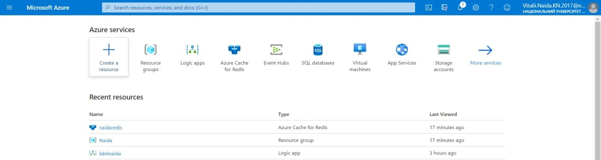
 2. Вибираєм назву для групи підписку і регіон -> Review + Create
 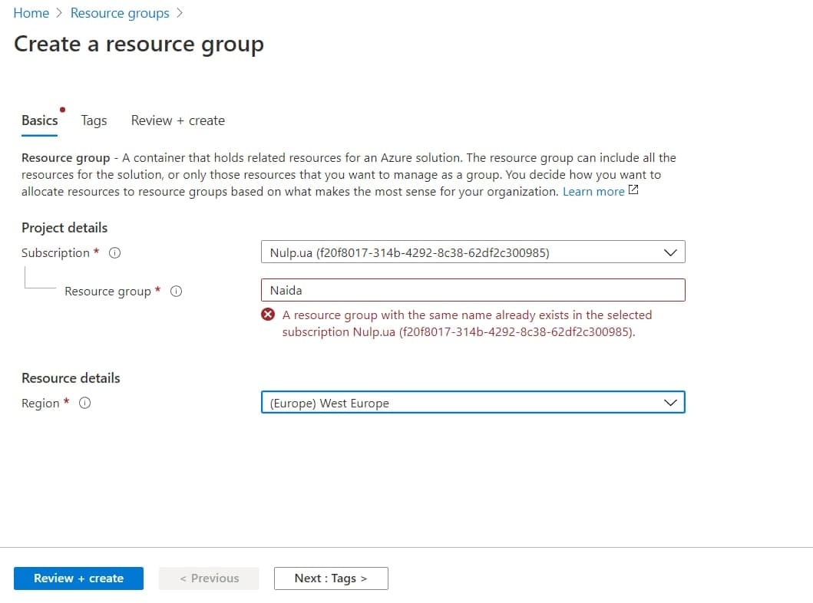
 3. Створюємо Azure Redis for Cache, обираєм групу у якій буде наш сервіс, називаєм DNS name, обираємо найближчий регіон, chache type рекоментований -> Review + Create
 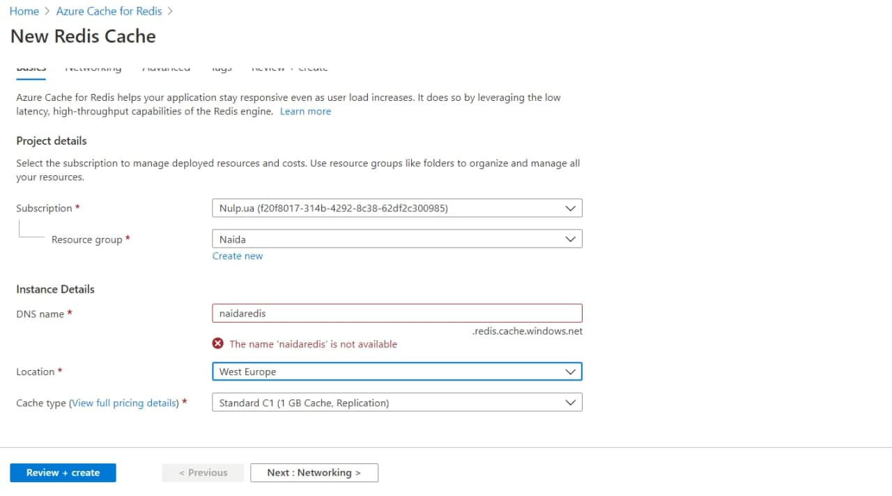
 4. Заходимо у наш redis у якому нам потрібно взнати Primary key і Primary connection string для запису стратегією redis
 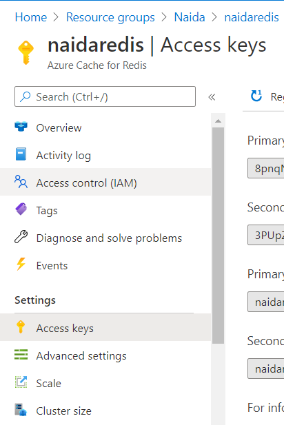
 5. Створюємо Evens Space, обираємо групу у якій буде наш сервіс, називаємо Namespace name, обираємо найближчий регіон, Pircing tier Стандартний -> Review + Create
 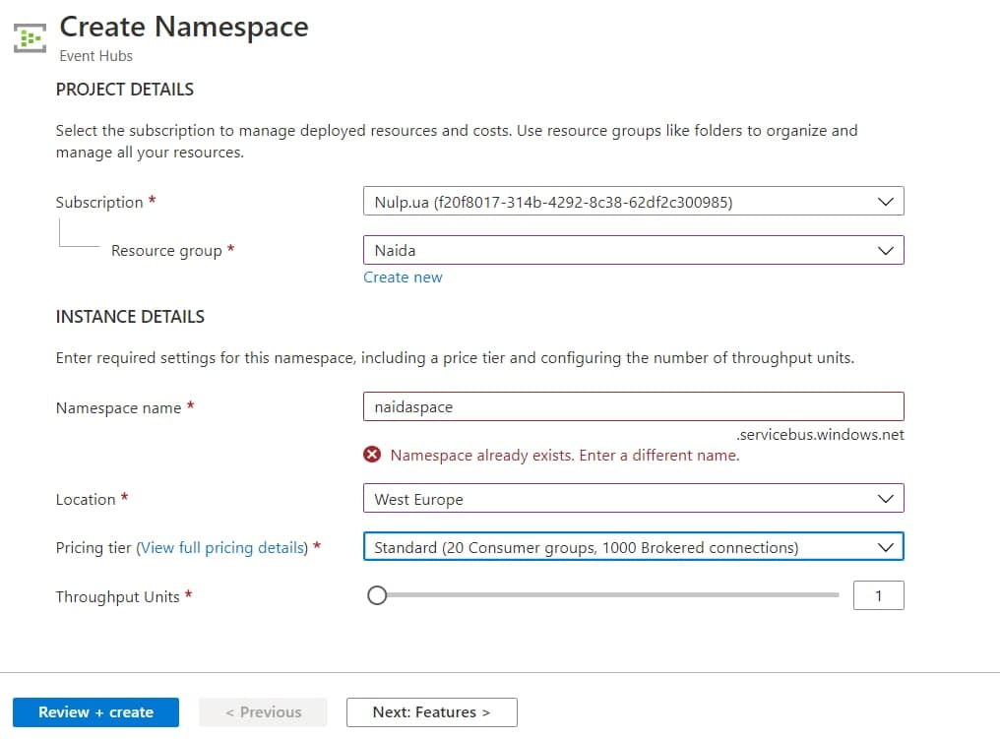
 6. Заходимо у створений Event Space і створюємо Event Hub нажавши кнопку +Event Hub або в лівому меню в розділі Entities -> Event Hubs при створенні Event Hub`у потрібно вказати лише його ім'я
 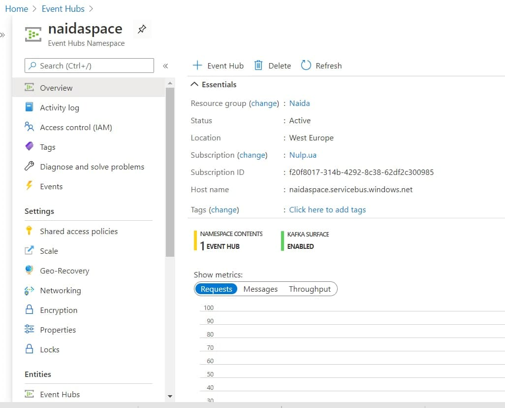
 7. Зайшовши в наш Event Hub потрібно нам створити policy - це можна зробити в лівому меню в розділі Settings -> Shared access policies -> + Add
 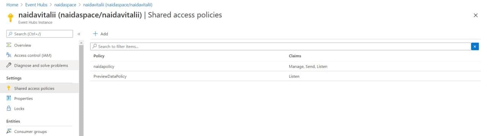
 8. У новому вікні обираєм назву policy та усі права натиснувши на Manage. Клікнувши на наш policy ми можемо отримати Primary key, Secondary key а також конекшени для них, які пригодяться нам для запису по стратегії eventHub
 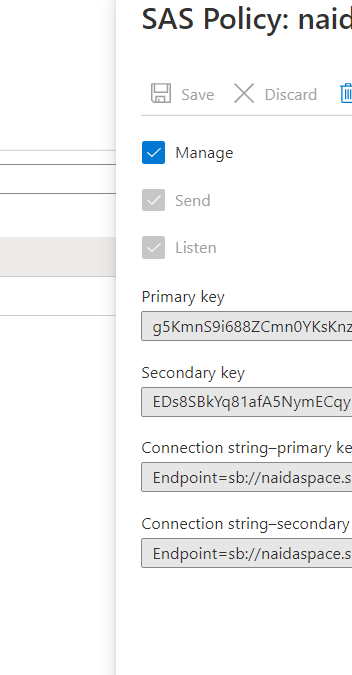
 9. Запустивши код програми написаний мовою Java потрібно записати дані з dataset`y, що ми зробимо за допомогою Postman
 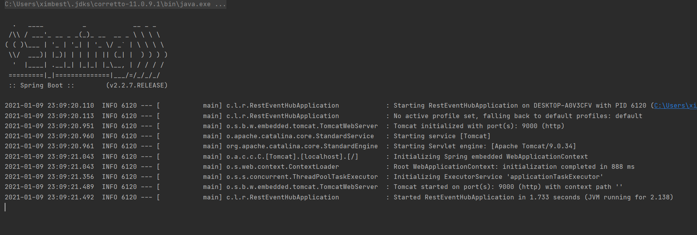
 10. У програмі Postman ми створюємо новий POST запит прописавши url'у у якій прописуємо localhost, сервер порт який можна дізнатись з файлу application.properties у дерикторії resources, і /url для виконання коду у файлі URLController @POSTMapping, для запису нам потрібно також у Headers створити новий Header зі значеннями Key = "Contetn-Type" Value = "application/json", а у розділі Body прописуєм запит raw, у якому url`y датасету і нашу стратегію на вибір які ми прописали у LogService класі
 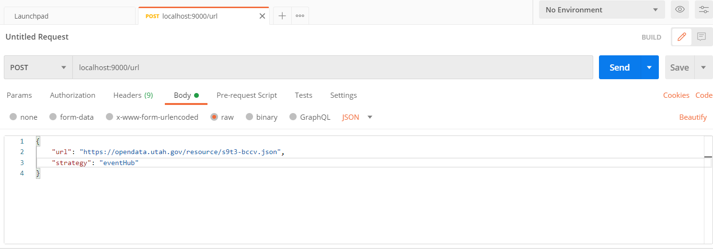
 11. Нажавши кнопку Send у програмі Postman ми можемо бачити в консолі програми те як записуються наші Документи за заданими стратегіями у відповідні сервіси Azurе'у після запису усіх даних ми можемо перевірити їх у redis console прописавши hgetAll і назву каталогу, а для стратегії eventHub у нашому eventhub`i у process data
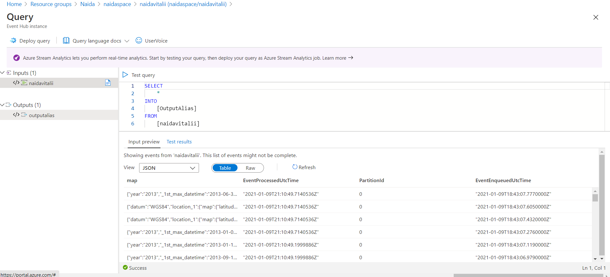
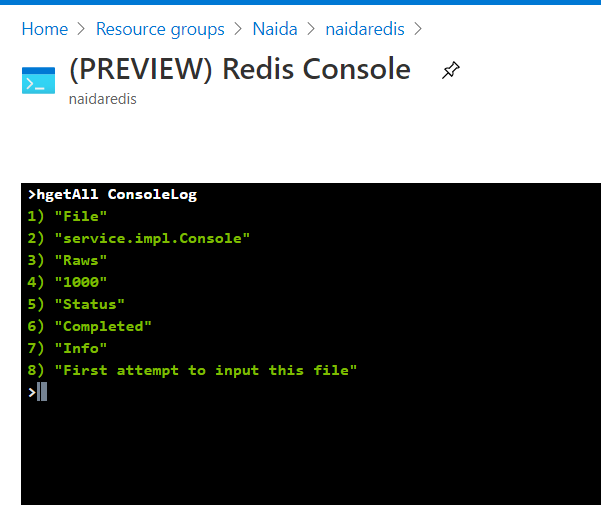
