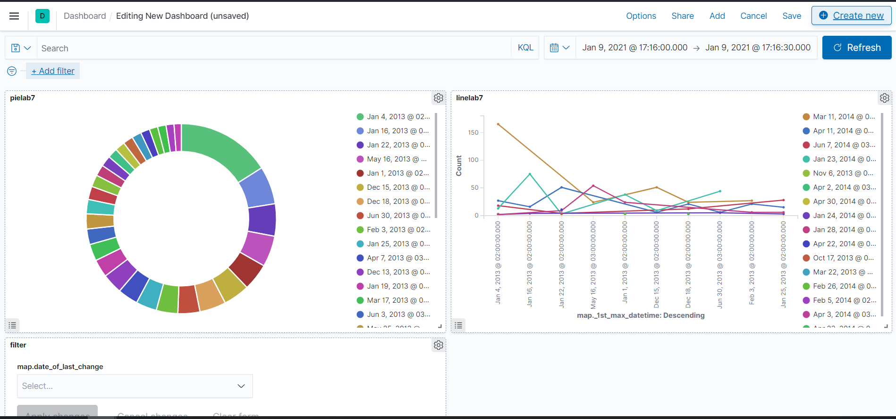

# LAB 7

1. Створимо в Kibana візуалізацію пирога, ліній та фільтр наших даних на Dashboard


2. При створені візуалізації потрібно обрати індекс у який ми записали наші дані через Logic app у Azure

3. У візуалізації потрібно додати бакети


4. Для створення візуалізації фільтра потрібно обрати Controls -> Option List -> Add та внести потрібні параметри після цього додати фільтр на dashboard також фільтревати дані можна задопомогою запитів


5. Для запитів використаємо приклад виведення усіх даних 
```
GET _search {
"query": {
"match_all": {}
}
}
```
 -також можна фільтрувати за допомогою таких команд як gte та lte це буде означати greater than or equal "value", or less than or equal "value" наприклад
  ```
    GET _search
  {
    "query": {
      "bool": {
            "must": [
              {
                "range": {
                "map._1st_max_datetime": {
                "gt": "2010-07-25",
                "lte": "2030-08-25"
              }
            }
          }
        ]
      }
    }
  }   
  ```
  
6. Детальніше про усі HTTP ріквести можна почитати на різних форумах більш детально для прикладу
https://www.elastic.co/guide/en/elasticsearch/reference/current/search-search.html
https://kb.objectrocket.com/elasticsearch/elasticsearch-cheatsheet-of-kibana-console-requests-251
