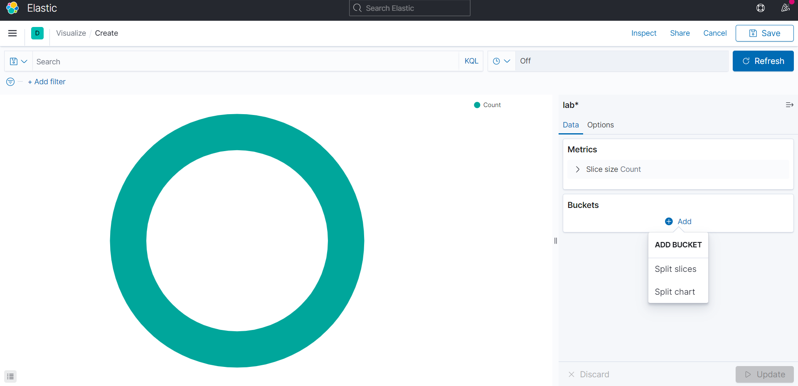
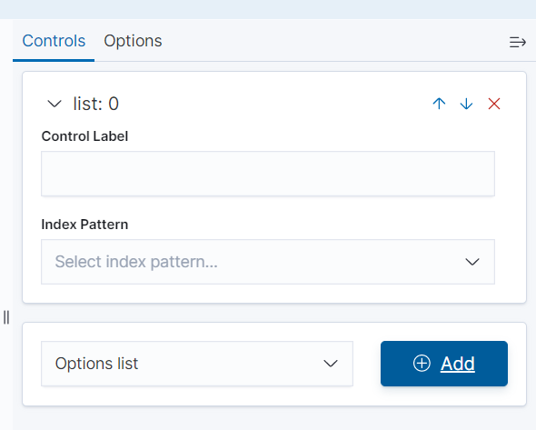

# LAB 7

1. Створимо в Kibana візуалізацію пирога, ліній та фільтр наших даних на Dashboard

2. При створені візуалізації потрібно обрати індекс у який ми записали наші дані через Logic app у Azure

3. У візуалізації потрібно додати бакети

4. Для створення візуалізації фільтра потрібно обрати Controls -> Option List -> Add та внести потрібні параметри після цього додати фільтр на dashboard також фільтревати дані можна задопомогою query запитів

